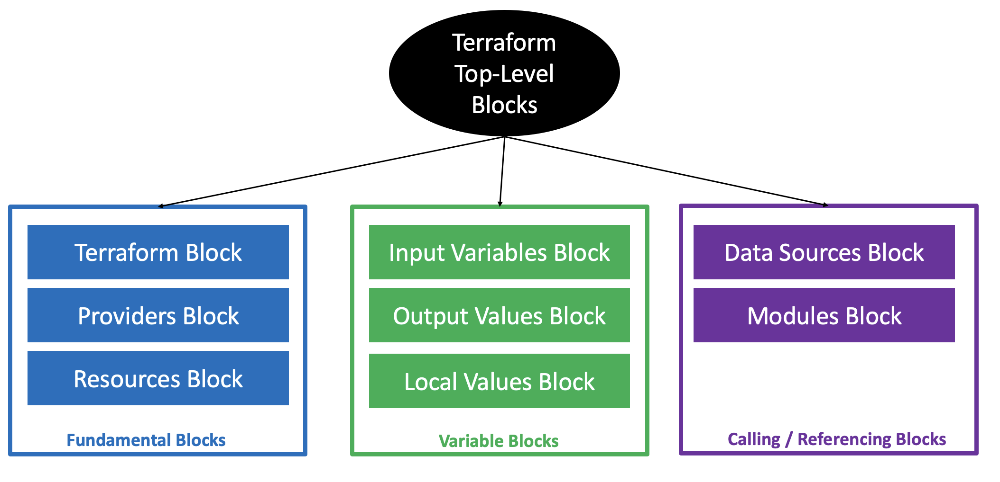

# Terraform Configuration Language Syntax

## Step-01: Introduction
- Understand Terraform Language Basics
  - Understand Blocks
  - Understand Arguments, Attributes & Meta-Arguments
  - Understand Identifiers
  - Understand Comments
 


## Step-02: Terraform Configuration Language Syntax
- Understand Blocks
- Understand Arguments
- Understand Identifiers
- Understand Comments
- [Terraform Configuration](https://www.terraform.io/docs/configuration/index.html)
- [Terraform Configuration Syntax](https://www.terraform.io/docs/configuration/syntax.html)
```t
# Template
<BLOCK TYPE> "<BLOCK LABEL>" "<BLOCK LABEL>"   {
  # Block body
  <IDENTIFIER> = <EXPRESSION> # Argument
}

# AWS Example
resource "aws_instance" "ec2demo" { # BLOCK
  ami           = "ami-04d29b6f966df1537" # Argument
  instance_type = var.instance_type # Argument with value as expression (Variable value replaced from varibales.tf
}
```

## Step-03: Understand about Arguments, Attributes and Meta-Arguments.
- Arguments can be `required` or `optional`
- Attribues format looks like `resource_type.resource_name.attribute_name`
- Meta-Arguments change a resource type's behavior (Example: count, for_each)
- [Additional Reference](https://learn.hashicorp.com/tutorials/terraform/resource?in=terraform/configuration-language) 
- [Resource: AWS Instance](https://registry.terraform.io/providers/hashicorp/aws/latest/docs/resources/instance)
- [Resource: AWS Instance Argument Reference](https://registry.terraform.io/providers/hashicorp/aws/latest/docs/resources/instance#argument-reference)
- [Resource: AWS Instance Attribute Reference](https://registry.terraform.io/providers/hashicorp/aws/latest/docs/resources/instance#attributes-reference)
- [Resource: Meta-Arguments](https://www.terraform.io/docs/language/meta-arguments/depends_on.html)

## Step-04: Understand about Terraform Top-Level Blocks
## Terraform Top-Level Blocks

- Terraform language uses a limited number of top-level block types, which are blocks that can appear outside of any other block in a TF configuration file. 
- Most of Terraform's features are implemented as top-level blocks.
- Terraform Top-Level blocks
  - Terraform Settings Block
  - Provider Block
  - Resource Block
  - Input Variables Block
  - Output Values Block
  - Local Values Block
  - Data Sources Block
  - Modules Block
- So we can categorized these things into three major blocks.
  - Fundamental Blocks
    - Terraform Settings Block
    - Provider Block
    - Resource Block
  - Variable Blocks
    - Output Values Block
    - Local Values Block
  - Calling / Referencing Blocks
    - Data Sources Block
    - Modules Block

    

  ##
  


